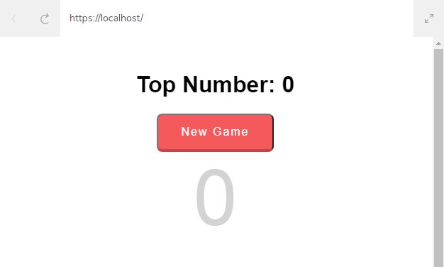

## LESSON Updating/Unmounting Lifecycle Methods

Learn about lifecycle methods that occur when a component updates or unmounts from the DOM.

Exercises

1. Updating Lifecycle Methods

2. componentWillReceiveProps

3. shouldComponentUpdate

4. componentWillUpdate

5. componentDidUpdate

6. componentWillUnmount

7. Lifecycle Methods Recap

